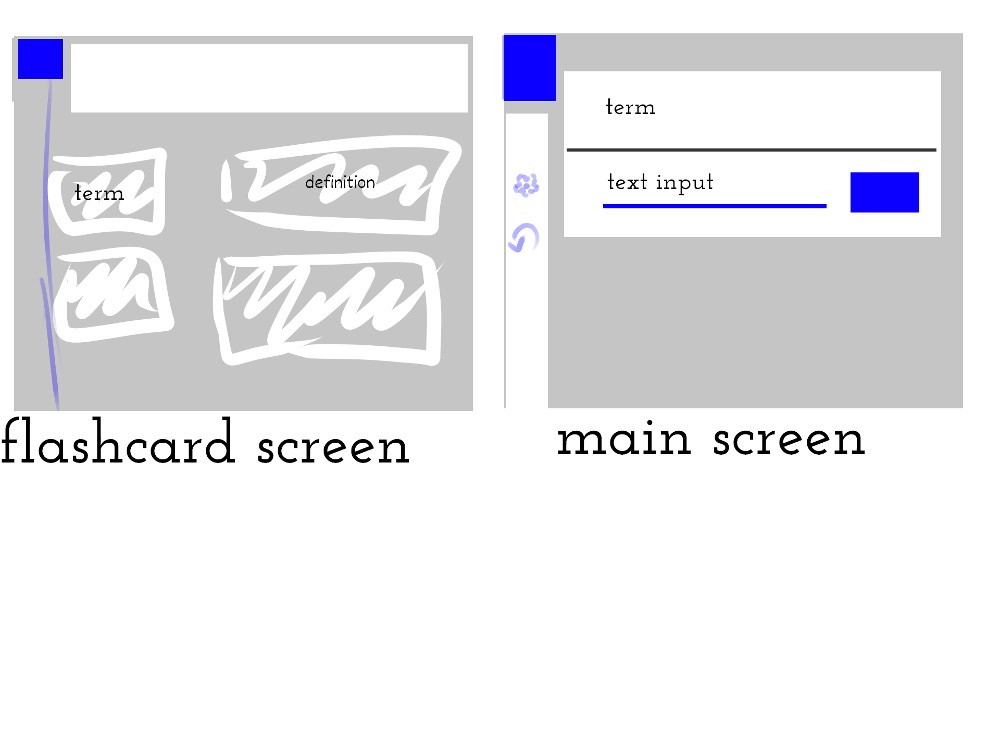

# Flashcard Learning

[My Notes](notes.md)

> [!NOTE]
>  This is a template for your startup application. You must modify this `README.md` file for each phase of your development. You only need to fill in the section for each deliverable when that deliverable is submitted in Canvas. Without completing the section for a deliverable, the TA will not know what to look for when grading your submission. Feel free to add additional information to each deliverable description, but make sure you at least have the list of rubric items and a description of what you did for each item.

> [!NOTE]
>  If you are not familiar with Markdown then you should review the [documentation](https://docs.github.com/en/get-started/writing-on-github/getting-started-with-writing-and-formatting-on-github/basic-writing-and-formatting-syntax) before continuing.

## 🚀 Specification Deliverable

> [!NOTE]
>  Fill in this sections as the submission artifact for this deliverable. You can refer to this [example](https://github.com/webprogramming260/startup-example/blob/main/README.md) for inspiration.

For this deliverable I did the following. I checked the box `[x]` and added a description for things I completed.

- [x] Proper use of Markdown
- [x] A concise and compelling elevator pitch
- [x] Description of key features
- [x] Description of how you will use each technology
- [x] One or more rough sketches *(very rough in this case)* of your application. Images must be embedded in this file using Markdown image references.

### Elevator pitch

So I'm thinking, currently, of doing what the learn function/minigame in quizlet used to be, before they made it all weird.

### Design

OK so I'm still a little unsure on certain details of how flashcard sets are going to be implemented, as it's based on quizlet which uses user-uploaded flashcard sets and such. To start out, I'm thinking that it'll just have a few pre-existing/hardcoded flashcard sets that the user can select from, and if I can find a way to get flashcard sets directly from quizlet itself, maybe do that. So currently, there will be a screen for selecting a flashcard set, a scene to scroll through the flashcard set, a screen to actually do the practicing (with a settings popup) and a high score popup of some sort.

### Key features

- selecting a flashcard set
- running the game
- swapping terms/definitions
- high scoreboard
for the game itself, the site would basically test you on typing in the definitions for each term until they're all done correctly; it could also be swapped to have the "definitions" as the prompt and the term as the thing typed in.

### Technologies

I am going to use the required technologies in the following ways.

- **HTML** - at least three distinct screens
- **CSS** - should work on desktop and mobile
- **React** - the practice game itself, high score settings
- **Service** - again, the game itself, if possible (probably not) getting flashcard sets from quizlet, and I thought it would be fun to have a sunrise/sunset notifier that asks if you want to pause to look outside 
- **DB/Login** - secure login/account system
- **WebSocket** - sunrise notifier, get notifications if someone else is studying the same set perhaps

## 🚀 AWS deliverable

For this deliverable I did the following. I checked the box `[x]` and added a description for things I completed.

- [x] **Server deployed and accessible with custom domain name** - [My server link](https://oldquizletlearn260.click).

## 🚀 HTML deliverable

For this deliverable I did the following. I checked the box `[x]` and added a description for things I completed.

- [x] **HTML pages** -pages for set select, sets, editing sets, playing the game itself, login, high scores, and settings. I might still need to change how these interact bc some things might not work unless the user is logged in, or like a winscreen would only be triggered by the javascript
- [ ] **Proper HTML element usage** -
- [x] **Links** - Pages link to each other as appropriate, and to github
- [ ] **Text** - there sure is text in there
- [x] **3rd party API placeholder** - sunset notification on play screen
- [x] **Images** - back button
- [x] **Login placeholder** - it's there
- [x] **DB data placeholder** - placeholder data for the flashcard sets, high scores, honestly a large percentage of the text in the final thing is going to be from the DB data
- [x] **WebSocket placeholder** - again, sunset notification on play screen, as well as the updating timer for the score and the updating of the placing on the high scoreboard of that time

## 🚀 CSS deliverable

For this deliverable I did the following. I checked the box `[x]` and added a description for things I completed.

- [ ] **Header, footer, and main content body** - I did not complete this part of the deliverable.
- [ ] **Navigation elements** - I did not complete this part of the deliverable.
- [ ] **Responsive to window resizing** - I did not complete this part of the deliverable.
- [ ] **Application elements** - I did not complete this part of the deliverable.
- [ ] **Application text content** - I did not complete this part of the deliverable.
- [ ] **Application images** - I did not complete this part of the deliverable.

## 🚀 React part 1: Routing deliverable

For this deliverable I did the following. I checked the box `[x]` and added a description for things I completed.

- [ ] **Bundled using Vite** - I did not complete this part of the deliverable.
- [ ] **Components** - I did not complete this part of the deliverable.
- [ ] **Router** - Routing between login and voting components.

## 🚀 React part 2: Reactivity

For this deliverable I did the following. I checked the box `[x]` and added a description for things I completed.

- [ ] **All functionality implemented or mocked out** - I did not complete this part of the deliverable.
- [ ] **Hooks** - I did not complete this part of the deliverable.

## 🚀 Service deliverable

For this deliverable I did the following. I checked the box `[x]` and added a description for things I completed.

- [ ] **Node.js/Express HTTP service** - I did not complete this part of the deliverable.
- [ ] **Static middleware for frontend** - I did not complete this part of the deliverable.
- [ ] **Calls to third party endpoints** - I did not complete this part of the deliverable.
- [ ] **Backend service endpoints** - I did not complete this part of the deliverable.
- [ ] **Frontend calls service endpoints** - I did not complete this part of the deliverable.

## 🚀 DB/Login deliverable

For this deliverable I did the following. I checked the box `[x]` and added a description for things I completed.

- [ ] **User registration** - I did not complete this part of the deliverable.
- [ ] **User login and logout** - I did not complete this part of the deliverable.
- [ ] **Stores data in MongoDB** - I did not complete this part of the deliverable.
- [ ] **Stores credentials in MongoDB** - I did not complete this part of the deliverable.
- [ ] **Restricts functionality based on authentication** - I did not complete this part of the deliverable.

## 🚀 WebSocket deliverable

For this deliverable I did the following. I checked the box `[x]` and added a description for things I completed.

- [ ] **Backend listens for WebSocket connection** - I did not complete this part of the deliverable.
- [ ] **Frontend makes WebSocket connection** - I did not complete this part of the deliverable.
- [ ] **Data sent over WebSocket connection** - I did not complete this part of the deliverable.
- [ ] **WebSocket data displayed** - I did not complete this part of the deliverable.
- [ ] **Application is fully functional** - I did not complete this part of the deliverable.
